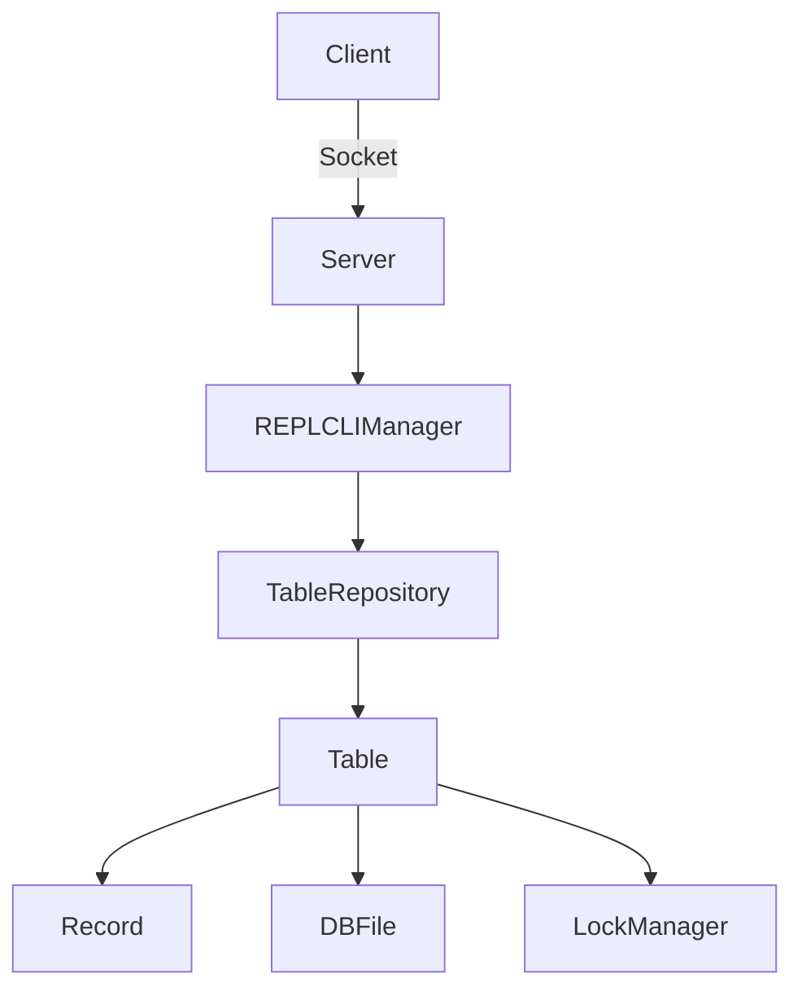

# JankDB 🏗️

**A lightweight multi-threaded key-value store with persistent storage, running over TCP, written in Java**

[](https://java.com)

```diff
+ Now with bulletproof concurrency controls! (they work!...sometimes)
```
## Features ✨
- CRUD table operations
- Multi-table support with table selection
- ACID-compliant operations per table
- Fine-grained locking with table-level synchronization
- Persistent storage with manual saving/loading
- Simple CLI interface with REPL and socket server
   - using SQL-like commands
- Thread-safe design using ReentrantLock and ownership tracking

## Architecture 🏛️

## Getting Started 🚀
### Prerequisites
- Java 17+
- Maven 3.8+

### Installation
```bash
git clone https://github.com/HShrigma/JankDB.git
cd JankDB
mvn package
```
### Usage
#### Start the server:
```bash
java -jar target/jank-db-1.0-SNAPSHOT.jar
```
#### Basic commands:

```bash
SET key value  # Stores a key-value pair
GET key        # Retrieves a value
DEL key        # Deletes an entry
SELECT table   # Switches active table
SAVE           # Persists all changes
HELP           # Lists all comands and what they do
        ...
```
## Concurrency Model 🔒
JankDB implements a sophisticated locking system:

- Reader-Writer pattern for efficient concurrent access

- Fair locking prevents thread starvation

- Timeout support for deadlock prevention *(kinda)*

- Ownership tracking with user sessions

## License 📄

The Unlicense. Go crazy.

## Goals

Really just getting used to Java more and trying something new. Honestly I wanted to do a tiny key-value store DB and then I wanted to host it over TCP for fun, but then I really went too much with the multi-threading. It definitely works but you can and will create deadlocks with unsafe client exits. This is something I plan to really test out and squash in future projects. Overall, I'm pretty happy with the result.

## Signing off
***It ain't much, but it's honest work.***
